I'm a young programmer with less than a year of experience who has spent countless hours on CodeWars in the last 6 months. As someone lacking a formal CS education, CW has honestly been my main source of learning. I've done MOOCs, read books, project euler, etc. Nothing comes close to the impact that CW has had on me as a struggling nooby developer.

I am now barely on the leaderboard, no thanks to any cleverness, but simply hours of work and yes even some test case hacking. CodeWars has always been a platform for learning first and foremost to me. For what it's worth, I would like to share my experience.

## Real Learning

I'm far from the best programmer, but I come from a family heavily involved in education and have spent thousands of hours debating and deeply contemplating learning and teaching methods. In school, I was blessed to be enrolled in an elite computer networking program with a top-tier teacher. I always hated school, and couldn't force myself through college, partially due to what I learned in that class:

> Real learning is practical.

I'm not using _practical_ in the normal sense. I don't mean "has economic value" or "pays the bills" or anything like that. In fact, Merriam-Webster's number 1 definition of _practical_ is:

> of, relating to, or manifested in practice or action : not theoretical or ideal

When I was in my networking class, gone were the normal fears, anxieties, and annoyances that us computer-people are so prone to. I had my hands on a keyboard for over half the time. The other half I was building PCs, installing drivers, wiring up routers, or making ethernet cables. **It wasn't work, it was play**.

You can imagine my shock when, at the end of the year, I was able to pass my Cisco certification and even rank pretty high in an international networking competition. How could it be? I spent all year having fun, where were these rewards coming from? Hello, imposter syndrome.

So maybe a better way of saying what I'm trying to say is

> Real learning is play.

Interestingly enough, Merriam-Webster's top definition of play is literally just this:

> Swordplay

Which is defined as follows:

> the art or skill of wielding a sword, especially in fencing

And again, _sword_ is defined as:

> a weapon (such as a cutlass or rapier) with a long blade for cutting or thrusting that is often used as a symbol of honor or authority

I just love that these are actually the top definitions. No cherry picking here. The points you earn on CodeWars are literally called **Honor**. It makes sense, though. Evolutionary biologists see play as a driving force in the development of individuals as well as species. In Indian philosophy, play is the primary creative force of the world. Is it really such a surprise that a tiger cub with a few brothers ends up a bit better at fighting/taking down prey than an only child? Look at these two lucky competitors:

Some links:

- [Play in evolution and development](http://evolution.binghamton.edu/evos/wp-content/uploads/2008/11/Pellegrini01.pdf)
- [Lila (Hinduism)](<https://en.wikipedia.org/wiki/Lila_(Hinduism)>)
- [Play](https://www.youtube.com/watch?v=DhbAzFw-7xg&feature=youtu.be&t=970)

## Wars

Flame wars, holy wars; developers are an opinionated bunch. It was only inevitable that we would create Code Wars.

Some of my first experiences on CodeWars were frantically reading through hacked solutions and issues for my authored kata. The so-called power users of CW are a force of nature; between Voile, ZED, and myjinxin breaking my test cases and Blind4Basics, Chrono, and Johan calmy explaining what's wrong with my code, I was suddenly faced with a plethora of challenges I never could have created for myself. This is ignoring the over 600 katas I have completed, but did not author. It's hard to believe CW is a free platform for learning.

One of my earliest "Aha!" moments was not technical in nature at all, but an early intuition of this idea I am now somewhat able to articulate.

> CodeWars is literally that: battles fought with code

It was shocking to have the chinks in my armor exposed and exploited. I designed a kata thinking everyone would just read my description and attempt the problem according to my specification. Oh, how wrong I was. Here are some of my favorite kicks in my butt showing just how clueless of a challenger I was/am, and how competent and helpful the CW community is:

From the #2 on the leaderboard:

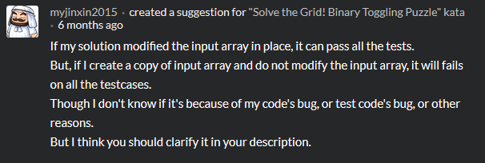

From the #3 (#1 imo) on the leaderboard:

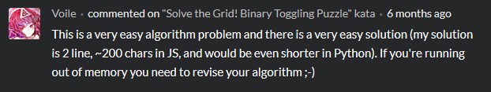

Overriding built-in methods? I had no idea!

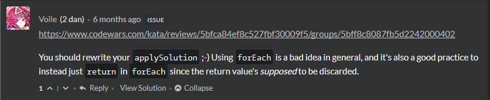

Whoops:

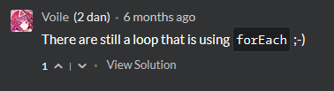

I had no idea how to write tests. Somehow boolean logic was just beyond me xD (#7 on leaderboard)

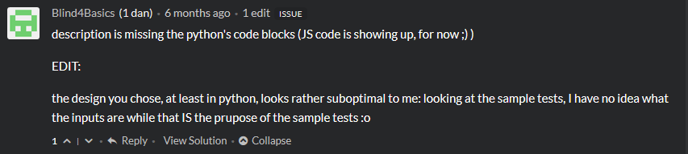

I broke half the solutions to my kata because I didn't know about backwards compatibility :/

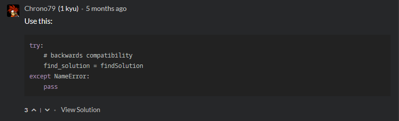

ZED (#20 but #2 imo) hacking away per usual:

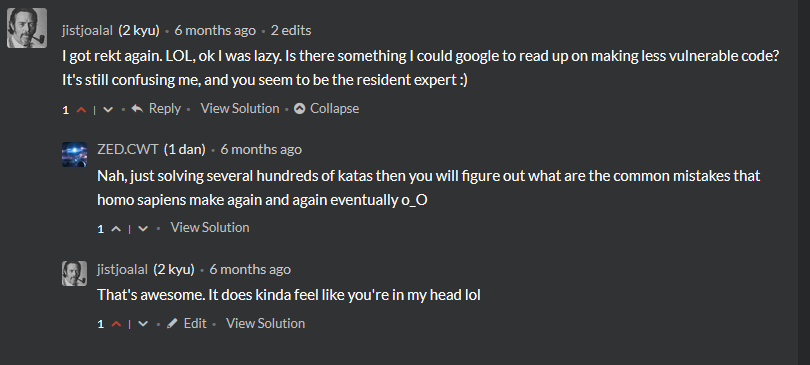

Learning the importance of immutability and (big shock) English.

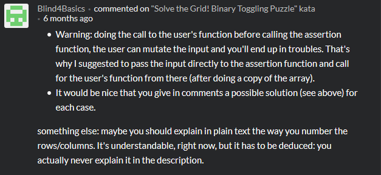

What habits? I'm out here winging it! This actually really helped while learning React. (#12 on leaderboard)

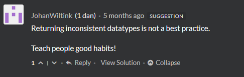

Learning about time complexity:

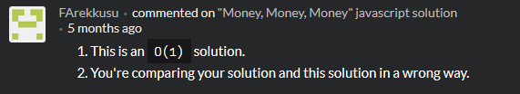

Hey look I fixed something! Oh wait more problems...

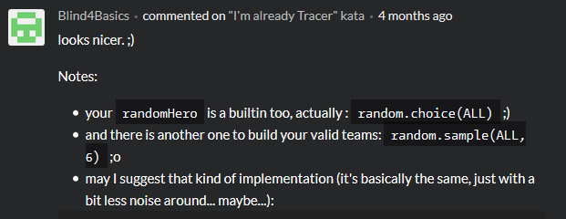

## Ow

So I was out here getting my butt kicked, and by some big boots. Not gonna lie, it was a bit painful at first, and I certainly didn't feel up to taking on some of the sharpest brains on the site. But I powered through, and even though I felt offended and dumb, I took a chance that these warriors would help me get better. I didn't even know where to begin with the "inconsitent data types" problem, but Johan wrote out a ~750 word reply walking me through how to fix it.

Instead of just ignoring this new noob on the block, ZED and Voile broke my tests until they were unbreakable. Blind4Basics, Chrono, and Johan encouraged and convinced me to follow best practices and write good tests. I wasn't getting beaten down, I was getting beaten up. Eventually, I started recieving some positive (or at least non-negative) comments on my code.

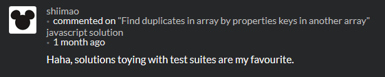

But of all my meager accomplishments on CW, this is beyond the most rewarding:

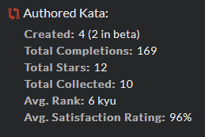

Over 100 other warriors have trained on my challenges! I'm 96% positive that satisfaction rating would not be as high without the help of the big kids on the block.

## The No Sword School

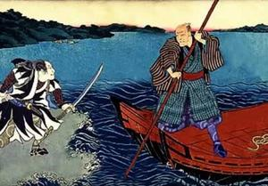

When I first joined CodeWars, I noticed you could pick a "clan" to align yourself with. I didn't know anyone on CW at the time, and didn't have any friends that programmed. But I was reminded of a story I heard in one of [Alan Watts' lectures](https://www.youtube.com/watch?v=DKs4RWZolZg).

He tells the story of the [Samurai Trilogy](https://en.wikipedia.org/wiki/Samurai_Trilogy), a series of films about the legendary Samurai and author Musashi Miyamoto. He begins like so,

> The highest accomplishment in fencing is called the No Sword School. To be so good at fencing that you never have to use a sword.

This may seem a bit antithetical to the point I'm trying to make in this post, but I don't think it is...

> It doesn't follow his life all the way through. It only comes to the point where he had a duel with another champion who insisted on challenging him out of vanity. And how Musashi takes him on fighting him at first only with an oar that has had the blade chopped off. But he maneuvers him into a position on the beach where the rising sun dazzles his opponent and when his opponent makes a terrific swipe at him he jumps over the sword draws his own sword and kills him instantly. But after that he is very unhappy that he had to kill such a swordsman and finally he takes the advice of the Zen master Takuan who'd all along been trying to dissuade him from a military career.

Musashi was a legend, not only due to his fighting skills, but because of his most famous bout which resulted in no fighting at all.

> So sometime later he was on his way to Kyoto and this meant that he had to cross Lake Biwa in a ferryboat, a small ferry boat that was rowed. And when he was on board another samurai who was a very vulgar fellow who had had too much sake to drink came aboard and saw Musashi. "Aye sir ah what school of swordsmanship do you belong to?" Musashi said, "The No Sword School." By this time the boat had started. "Ha! No Sword School! I'd like to see your No Sword School!" And this drunk drew his sword and Musashi said, "Now wait a minute, this is a crowded boat and if we start a duel people will get hurt and they're just innocent bystanders. Let's go to that Island over there and we can fight it out." So he said to the ferryman "Over to that Island" And he changed the course of the boat and went to the island. This drunken swordsman was so eager to get out and fight him that he jumped onto the sand and immediately Musashi took the ferryman's oar and pushed the boat back. He left him there and he said "You see my No Sword School!"

## The Shoulders of Giants

We stand on the shoulders of giants. Not just because we have clean, running water and heated homes. Not simply because we have access to more power and information than we can even make sense of. We stand on the shoulders of warriors, fighters, legends. How could we have ever evolved out of the harsh, cruel animal world if not, at some point, the man with the biggest, baddest sword **didn't use it**?

I like to think of Musashi's greatest battle as one of the first of it's kind. **A new kind of battle**. Legends don't fight with their fists or their swords, **they fight with their minds**. Musashi's restraint was not an act of mercy or righteousness. It was an act of wit. He didn't just let his opponent go free. He defeated him. No sword required.

## Play

So if _learning is practical_, and _practice is play_, maybe the modern world needs a new #1 definition for play:

> Mindplay

Which will be defined as follows:

> The art or skill of wielding a mind

And just as the most fearsome warrior's sword is not the sharpest, but the most worn, so it is with his mind.

[Go play](https://codewars.com)
