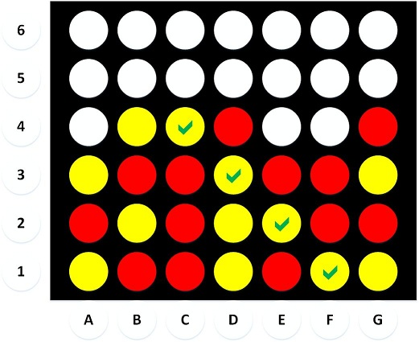

[Source Code](https://github.com/jistjoalal/connect-four)

Let's play Connect Four! Remember this game?



My favorite part as a kid was dumping all the pieces out.


Unfortunately dumping the pieces out is not part of the challenge for this [Kata](https://codewars.com). The challenge is as follows:

- Recieve a list of "moves" as input:

```js
piecesPositionList = [
  "A_Red",
  "B_Yellow",
  "A_Red",
  "B_Yellow",
  "A_Red",
  "B_Yellow",
  "G_Red",
  "B_Yellow",
]
```

- Return "Yellow", "Red", or "Draw" accordingly.

## The Plan

This kata is only 4 kyu, and apparently I'm getting better because my initial plan actually worked out! Here are my notes before attempting:

```js
/**
 * Connect Four - 4kyu
 * run(moves)
 * - Input: ["A_Red", "B_Yellow", ... ]
 * - Output: 'Red', 'Yellow', or 'Draw'
 * implementation:
 * - 7x6 grid
 * - iterate thru moves
 *   - insert into grid
 *     - translate move + grid state to new grid
 *   - check for connect-four
 *     - return Red/Yellow
 * - return Draw
 */
```

And here is my solution:

```js
const run = moves => {
  const g = rng(7).map(_ => "")
  for (let move of moves) {
    insert(move, g)
    const c = check(g)
    if (c) return c
  }
  return "Draw"
}
```

Pretty dang close right? I'm seriously falling in love with functional programming. It's real engineering. We design our finished product with all sorts of magical black boxes, and then we design those!

## The Grid

I settled on modelling the grid as an array of strings, each representing a column. The grid at the top of the post would look like this when printed:

```js
grid = ["YRY", "RYRY", "RRRY", "YYYR", "RYR", "YRR", "YRYR"]
```

It might seem confusing since strings print horizontally, but I can assure you all the information is there! Since we insert a piece based on the column alone, it will be convenient for our insert function to simply append the next move to a certain column.

Also, here is my beloved $rng$ function that I rewrite almost every day. It's the one thing tempting me back to python xD

```js
const rng = n => [...Array(n).keys()]
```

## Let's Play!

Our insert function does just that, inserts a piece into the grid. Remember this is what a "move" looks like:

```js
"A_Yellow" // inserts yellow piece into first column
```

So let's translate the first character to a column index for our grid, and push the third character ("Y" or "R") into the column.

```js
const insert = (move, grid) => {
  const r = "ABCDEFG".indexOf(move[0])
  grid[r] += move[2]
}
```

Yeah yeah, this function isn't pure, but I'm not fretting it.

## The interesting bit

So here's the real challenge, checking the board for a "Connect Four" win condition. In case you don't know the game, a connect four can happen vertically, horizontally, or diagonally. FP has us covered once again with an intuitive solution that will be easy to build the parts for:

```js
const check = g => {
  const all = [
    ...g, // rows
    ...cols(g), // columns
    ...diags(g), // left-up + right-up diagonals
    ...diags(flip(g)), // left-down + right-down diagonals
  ]
  for (let row of all) {
    const r = checkRow(row)
    if (r) return r
  }
  return false
}
```

$checkRow$ is the heart of our program, it takes a row and returns the win condition.

```js
const checkRow = row =>
  /RRRR/.test(row) ? "Red" : /YYYY/.test(row) ? "Yellow" : false
```

Simple! Obviously to check rows (horizontal) we just feed our grid in one row at a time. Columns and diagonals are more complicated, but let's **make them look like rows** so we can use the same check function!

## Columns

We need a function to "rotate" our grid 90 degrees and the rows will be equivalent to the columns of our original grid. This is essentially just translating every $(x, y)$ in our grid to a $(y, x)$. We also fill empty slots with zero to avoid a false positive for a case such as "R0RRR".

```js
const cols = g =>
  rng(6).map((_, i) => rng(7).map((_, j) => g[j][i] || 0).join``)
```

## Diagonals

Ok, here's the fun part. Because some of the diagonals aren't even four long, we actually only need to check 12 of the 24 possible diagonal paths. Because of the symmetry of the grid, I chose to break this down into 4 groups of 3 diagonals that all shared similar properties. Here's my MS paint I made while figuring it out:


The green (left-up) paths are the ones I tackled first. There's obviously three of them, and they are 4, 5, and 6 long. At each step along the path, we move up 1 and left 1. At each new path, we move right one. These are all arbitrary but it's just how I broke it down.

```js
const lu = rng(3).map(
  (
    i // 3 paths
  ) =>
    rng(4 + i).map(
      (
        o // 4,5,6 long
      ) => g[3 + i - o][o] || 0 // each step:
      //   -o (x) = move left
      //   +o (y) = move up
      // each path:
      //   +i (x) = move right
    ).join``
)
```

_Note:_ we fill blanks with zero to avoid false positives and join as strings to emulate our original grid.

Cool! Let's go after the blue (right-up) paths with a similar strategy:

```js
const ru = rng(3).map(
  (
    i // 3 paths
  ) =>
    rng(6 - i).map(
      (
        o // 6,5,4 long
      ) => g[1 + i + o][o] || 0 // each step:
      //   +o (x) = move right
      //   +o (y) = move up
      // each path:
      //   +i (x) = move right
    ).join``
)
```

## Halfway there

My MS paint represents half the diagonals, let's wrap em up with a function:

```js
const diags = g => {
  const lu = // ...
  const ru = // ...
  return [...lu, ...ru];
}
```

## Flip it!

Symmetry is the best. Our world would still be a big bang soup of radiation without it. Let's flip our grid and run our diagonal algorithms again to get the remaining paths.

```js
const flip = g => g.map(r => [...r.padEnd(6, 0)].reverse().join``)
```

_Note_: We pad the end of our columns to ensure they're aligned properly after the flip.

And now we have **all** possible diagonal paths through our grid. It's as easy as gluing our black boxes together.

```js
allDiags = [...diags(g), ...diags(flip(g))]
```

Efficiency, shmuficiency! Functional programming in javascript is practically English!

## Conclusions

I enjoy programming at a high level of abstraction. It is fun to get my hands greasy every once in a while, but writing programs that are easily readable is beyond fun. All of these map calls are surely expensive, but I like to think the programming style I'm developing allows for dealing with that shit later. My code passed the tests, all 206 of them in 1420ms!

As for some optimization thoughts, maybe I could write a $checkCols$ or $checkDiags$ function that combined the translating and checking elements. But at the moment, I don't know how I'd make that code as readable.

Another thought is removing the hard coded column and row lengths to allow for bigger grids/games. According to the [wiki page](https://en.wikipedia.org/wiki/Connect_Four), Connect Four is a "solved game". It's obviously much more complex than tic-tac-toe, but it follows the same principle of determinstic outcomes. Maybe I'll have some fun getting my hands greasy with this problem eventually. We need an "advanced connect four" kata :)
