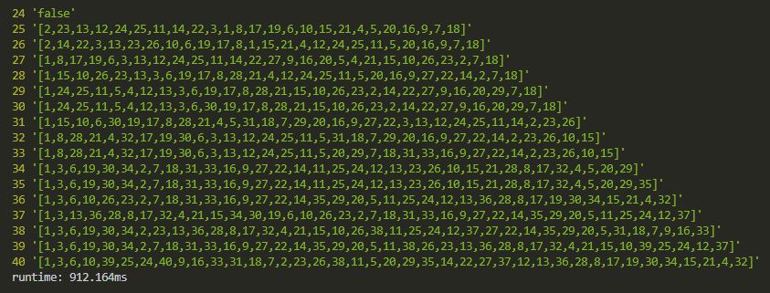
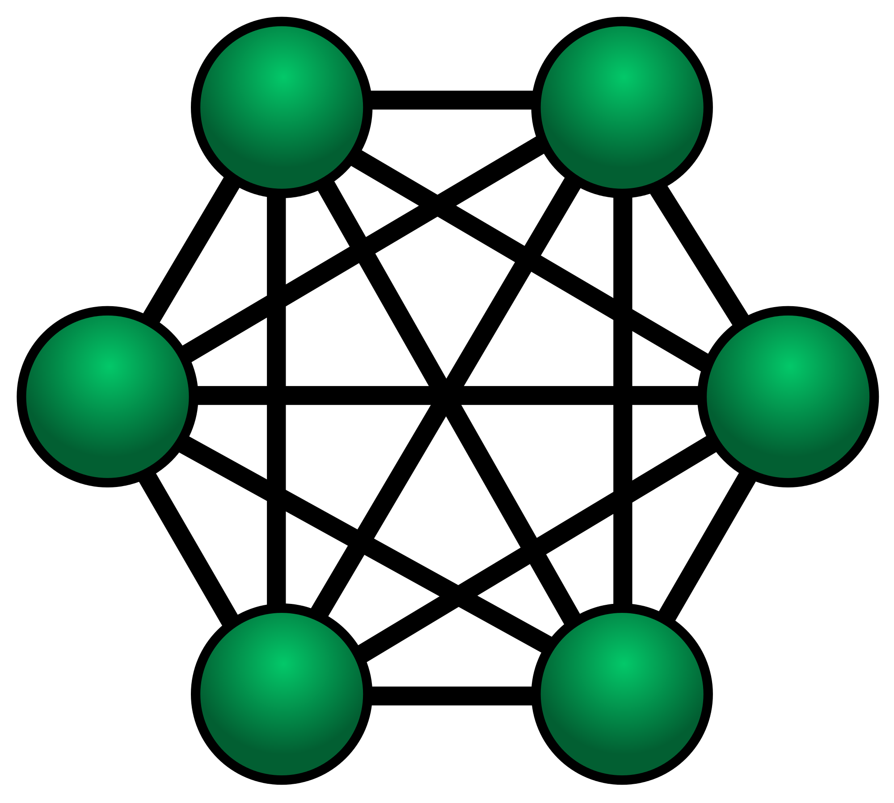

After setting myself some impossibly abstract goals such as learning "web development" or "how computers work", I soon became well aware of this strange phenomenon.

> Decisions are bad.

The blogs and the books told me to learn front-end, back-end, UI libraries, design principles and programming best practices. When I began my research, I couldn't believe the WWW is about the same age as me. There are **infinite** resources, tools, documents, guides, tutorials and **opinions**.

My early learning swung heavy to the side of reading and feeling overwhelmed. Maybe that's how it's supposed to be at first, but now I try to spend most of my time working on projects and _not making decisions_. There is no progress to be made in chaos. Setting rules and disciplining my education revved up my progression.

So recently my mantra has been "decisions are bad, progress is good". Or something along those lines.

## Excuses

A few months into this new gear and I was starting to redline a bit. I haven't done formal math for years and have recently been doing about 4 hours a day. Predicate logic, set theory, proofs, and my brain was a mushy pile of pudding. Also, I'm more of a hacker than a prover, if that's even a distinction to be made. Mathematicians think the proof is in the recipe. Engineers know the truth, they just can't prove it!

I've been encountering more and more problems that I can't hack. That wizard feeling when it "just works", is really not as great as I thought. I'm out for the new high: understanding what I'm doing.

## The problem

So I brute-forced project euler problems and broke test cases on codewars for a while and those bastards got me hooked! They said, "Look at all this cool stuff you don't understand!" The real tragedy came when I started to encounter problems I couldn't solve--didn't even know how to put a dent in.

So here is the hard version of the problem from my last post, [A hard problem](/blog/hard-problem). We left off with our program slowing down around $n = 50$.



## Find the way

So I've got some sequences of integers that sum to perfect squares. I've learned that these represent a Hamiltonian path through an undirected, unweighted graph and I am using DFS to recursively move through the graph. The "branches" of the path are determined by the edges in the graph. My edges algorithm filters duplicates from the current vertex's row of our adjancency table.

In my last post I included many of the ideas I explored while designing a solution that would get me up to $n = 1000$. Here they are again with the ones that panned out in bold:

- caching / memoization of recursive calls
- optimizing the adjacency table construction
- **optimizing the adjacency table output**
- **verifying whether a number has already been used more efficiently**
- finding the path based on end instead of start
- **using different data structures**
- **sorting the edges, since this would presumably have an effect on DFS search-times**
- avoiding newish syntax like destructuring
- praying to the one true god, RNGesus

## Optimizing the adjacency table output

When I'm not torturing myself with math I like to build web apps with React and other high level libraries. I like to think of it as combining bottom-up and top-down learning, but really it's just fun :) So Javascript is my best language and I really should have got this one sooner from my React experience. My "hash table" adjacency table design was using JS objects which can be notoriously slow. Swapping it out for an array with identical indexes gave us a few ms that will add up when going for bigger values of $n$. Here is the specification of the adjacency table generation.

```js
// we insert an empty list for n = 0,
// and spread the mapped matches for [1..n]
const adjacencyTable = n => [[], ...rng(n).map(matches(n))]
// n's row of the table
const matches = n => c => rng(n).filter(sqSum(c))
// evaluates true when a and b sum to perfect square
const sqSum = a => b => Math.sqrt(a + b) % 1 == 0
```

## Set

The next two improvements ended up being implemented by the same thing: a Set! Arrays are useful for lists of elements with duplicates, but the set is the fundamental structure of mathematics and has the defining property of containing **distinct** elements. This structure is much more relevant to our problem, and big surprise: ended up working better.

To everyone's surprise, [Javascript has us covered](https://developer.mozilla.org/en-US/docs/Web/JavaScript/Reference/Global_Objects/Set).

> The Set object lets you store **unique** values of any type...

Our current edges algo grabs the adjTable of the last number in the path so far, and filters out any vertices already in the path.

```js
const edges = (adjTable, start) =>
  adjTable[last(start)].filter(v => !start.includes(v))
```

We already improved the adjacency table lookup a little bit, so now the obvious candidate is our horribly slow filter method. The problem is we are iterating through each result from the table, and iterating through the path to see if each result is included. If we say our table row has length $l$, and our path length $m$, this function is $O(n^2)$. Not mention it is being called from within our DFS, this is a major factor slowing us down.

The fix is basically swapping our $start$ array for a set, with some caveats. Sets can't be indexed like arrays, so we need another argument for the current vertex. We also can't easily get a set's length, but it's easy enough to increment a counter argument as part of our recursion to keep track of the path length. I will cover most of these changes later, but here are the changes to the edges algo:

```js
const edges = (at, adjTable, set) => {
  return adjTable[at].filter(v => !set.has(v))
}
```

Because $set.has$ is $O(1)$ under the hood, our new edges function is $O(n)$. For our small test of $n = [1..40]$ this improvement cut our runtime by more than half. I really need to keep studying data structures and algorithms, this stuff is superpowers.

## The big one

Yeah, yeah, yeah... best practices are good and all, but I need speed if I'm ever gonna get to $1000$. There's something clever here that I am not sure I'm even 50% caught onto, but it's cool and I'll try my best to explain it.

## Mesh

The first thing you can notice when looking at the first few solutions way above is that many of the sequences begin with 1. This is due to our purely iterative approach to finding a path (first look for paths starting with 1, then starting with 2, etc.). From this we can assume that either there is something special about starting with 1 or that these are just the first paths our program finds because there are **multiple** hamiltonian paths through the graph.

Because of our DFS approach to searching, we are always returning the first path that is hamiltonian, of all possible paths in [lexicographical order](https://en.wikipedia.org/wiki/Lexicographical_order). Since the problem only expects a _valid path_, we could hypothetically return any other path, not simply the lexicographically first path.

The reason this is important to note (and it took me a while), is because when $n$ starts to grow very large, the network becomes increasingly **mesh**, or dense with edges/connections.

Since we are iterating through the edges linearly at each branch point, we can see clearly in the patterns of our solutions that many dead ends are being explored. For example look at the above result for $n = 29$. The fact that the sequence begins $[1, 24, ...]$ means that all paths starting with $[1, 3, ...]$ were explored, all that start with $[1, 8, ...]$, and indeed all other integers that form edges with 1 that are less than 24 were explored.



Assume worst case scenario: that our graph is _full mesh_, such as in the image above (mesh computer network topology diagram). Since we can only visit each vertex once, we see that the number of edges at the current vertex along the path decreases by one for each vertex we traverse. In other words, the permutations of the path will have cardinality of $n!$.

We can easily see that a path of length $(n - 1)$ would have a permutation set of cardinality $(n - 1)!$. Because of the recursive nature of our DFS solution, we can infer that a path beginning with something like $[1, 24, ...]$ must have fully explored _multiple_ $(n - 1)$ paths. By our arguments, we can see that pure DFS alone in search of a hamiltonian path is basically a glorified short-circuiting permutations algorithm. Our function is $O(n!)$, and therefore has the potential of being very inefficient. These inefficiences arise for any $n$ that does not have a "lexicographically early" solution, under our current implementation.

## Big words

So as you can tell by my nonsense vocabulary and consistently round-about reasoning, the books have learned me much. So many big words, and so much more to consider. But I must concede that this is where my formal knowledge of this problem ends, and the engineer's intuition takes over. I definitely cannot explain this problem mathematically, I barely even solved it.

## The maze


Picture yourself in the center of a maze. You have a piece of chalk to mark your way so you don't start going in loops. Presumably there could be more than one way out of this maze, and you're certainly going to have to make **many decisions** along the path if you're ever to get out. You may have heard of the "keep your left hand on the wall" strategy before or maybe you have a more clever intuition for finding a way out. [Mazes](https://en.wikipedia.org/wiki/Maze_solving_algorithm) present a lot of [fun programming problems](https://www.youtube.com/watch?v=rop0W4QDOUI).

In fact, we can model a maze in much the same way that we've modelled our integer square sum relationships. That's the cool part about math I guess, it gives you cross-context tools. What's the model? You guessed it: a Graph.

If we declare any junction in the maze (where a decision must be made) to be a vertex, and paths connecting vertices to be edges, we have our graph.

Now I'm really not sure of the mathematical validity of this argument or analogy, but I've presented a unique maze problem in that I haven't given a lot of information. I haven't told you anything about the maze or where you're starting in it. Just that you have a mechanism for avoiding loops and there _is_ a way out. However I do believe there is an optimal strategy _given_ that initial information. I also believe this is analogous to my square sums problem.

First I'll say how I think it's relevant to my codewars challenge. Other than both problems being represented by graphs, the "goal" is also essentially the same: To reach some end condition. You are given a mechanism for avoiding loops, but you will still be faced with decisions as to which branch of the path through the graph you will explore. The "meta-goal" is to minimize the time spent searching for the end condition.

## The optimal strategy

So you have this mechanism for avoiding loops, and let's say its basically automatic. What are you really considering then with the goal of getting out of the maze? Maybe this is an adequate description of what we're looking for:

> Maximize ground covered, while minimizing dead ends explored.

It seems, and again this just intuition, that this would ensure you would always be _approaching_ the end condition at relatively maximum speed. But how in the hell do you minimize dead ends explored? As far as I know we don't have an npm package for seeing into the future yet. Also I can't import packages on codewars.

What if there were a _hack_? (I'm realizing that's just a word for not understanding what you're doing) What if there were a way to minimize visiting dead ends, only with the information at hand?

Let's consider a moment in the maze. You reach an intersection with two possible paths. You can see down one path another junction in the distance with 1 additional path branching off. The other initial path has a junction in the distance but with 2 additional branches. Does this new information lead you to any intuitions about your best bet on which way to go?

Maybe you're like me and you hate making decisions. So you pick the path that (as far as you know) has only one decision to make. Seems good right? We're stuck in this maze for all eternity as far we know, so we might as well get into that state of just going with the flow. There are no clever solutions, so sitting around making decisions is only a waste of time in the long term.

So I'm analogizing the energy cost of having to choose which way to go at a junction in the maze with the time cost of my $edges$ algorithm. (Un)like humans, computers demand time and energy just to determine the options that lie ahead of them.

## Wasted Time

We're still iterating linearly through our edges which is analogous to the "left hand on the wall" strategy for solving a maze. It's "guaranteed" to work, but at what time cost? We almost always end up exploring a large fraction of the maze "to the left" of our solution (1st lexicographical permutation). How do we hit that sweet-spot-flow path that from a bird's eye view looks much more "relaxed", and not so robotically shifted to one side?

I'm reminded of a Roomba vaccuum my friend had in middle school (~2007) and the chaotic, yet very methodical paths it would take. There's always a hilarious stupidity to our first prototypes for time-saving mechanisms. You can vaccuum it yourself in 10 minutes or watch this brain-dead robot bump all over your house all day. My algorithm is still an early prototype Roomba.

So now that I've wasted enough of your time, here's the solution.

By analogy, we seek to minimize the total "decisions" needed to be made throughout our journey/path. For each decision we make, we choose the option that (as far as we can tell) **leads to the fewest decisions in the future**. By actuality, we seek to minimize the number of recursive calls to our DFS algorithm, since this will in turn create fewer calls to our edges function. For each call to edges, we wish to sort them by the number of connecting edges for each vertex returned by the first call to edges.

So let's design a new edges function that calls back to the original. It's a good old tangled up solution, and Javascript certainly doesn't make it any more eloquent. Let's call it $routes$.

```js
const routes = (at, adjTable, set) =>
  // same as before
  edges(at, adjTable, set)
    // map each edge to [edge, edges(edge).length]
    .map(v => [v, edges(v, adjTable, set).length])
    // sort by "edge length" INC order
    .sort((a, b) => a[1] - b[1])
```

Crazy right? By adding this little bit of work in the short term we actually save **tons** in the long term. I'm talking enough to push $n = 1000$ and then some. Honestly, I never expected this to improve the runtime of my algorithm so much. It goes to show how much I need to continue my formal CS education.

## Solution

The pieces are all assembled, and they basically go together the same way as before. Here is the new DFS algorithm:

```js
const findPathWithStart = (at, adjTable, n, set = new Set(), c = 1) => {
  set.add(at)
  // sets keep track of the order elements were added,
  // so when our counter var reaches it's terminal condition
  // we can spread (cast) the set as an array to return it
  if (c == n) return [...set]
  const es = routes(at, adjTable, set)
  // we destructure edge as the 0th element of the tuple returned
  // by our new routes function
  for ([edge] of es) {
    const branch = findPathWithStart(edge, adjTable, n, set, c + 1)
    if (branch) return branch
  }
  set.delete(at)
  return false
}
```

Our full solution to this very hard (and genuinely awesome) challenge, is the following function:

```js
const sqSumPath = n => {
  const adjTable = adjacencyTable(n)
  // we sort our starts the same way as the edges at each vertex
  const starts = rng(n).sort((a, b) => adjTable[a].length - adjTable[b].length)
  // same as before
  for (let start of starts) {
    const path = findPathWithStart(start, adjTable, n)
    if (path) return path
  }
  return false
}
```

## Conclusions?

Like every mind-bending problem I stumble upon, this one has left me with infinitely many more questions than I had before. The questions are all so interesting it's hard to see solving the problem as an "answer". I'm not sure what I'm looking for exactly.

I want to explore this notion of minimizing decision making. Computers and humans alike have a cost associated with the mere act of making a decision, ignoring the outcome. Have you ever heard a professional athlete tell you _exactly_ how they won the big game? No way. Athletes know that decisions are the enemy. They habitually force themselves into a reflex-driven flow state because they know, undisputed, that's how they perform best.

I really don't know, still a noob. But I think maybe the universe has a thing for decision makers that don't teeter around. As we begin to offload our decision making to our machines, how can we seek to integrate this harmonious way of deciding into our programs? Especially when it seems to be so distant from formal academic study, and yet so clearly vital to our daily lives and the world around us.

I don't want a Roomba that bumps all over my house. And I don't want to write programs that bump all over my problem domain. You've got ground to cover, be smart about it.

That's about as good as I can wrap this one up :)
