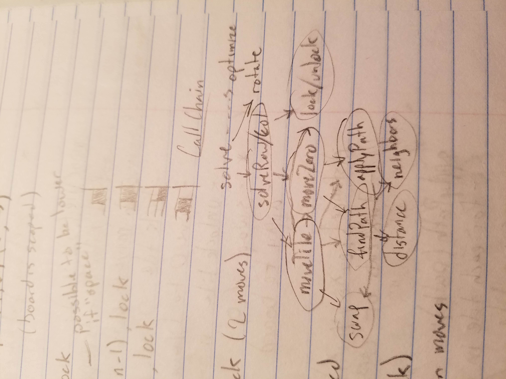

Back with another CodeWars 1 kyu. This time we're solving sliding puzzles. I started school in the middle of solving this problem which was only slightly infuriating. I hate leaving things unsolved so when I finally got some time I came back to it with a fresh perspective and was able to solve it. As usual I learned some new theory and have a bunch of new questions and intuitions about solving problems with software.


## The Problem

The sliding puzzle was the original rubik's cube. A "15-puzzle" is a grid of 15 tiles that must be rearranged in order, with the empty space in the bottom right. A solution to this puzzle is a sequence of moves or swaps between the empty tile and an adjacent tile. Because we only make swaps with the empty tile, every step is just a slide of a tile.

The challenge is to design a function that accepts a 2d array of tiles and outputs a list of slides to solve a $n * n$ puzzle, for any n where $3 \le n \le 10$.

```js
/**
 * 1 2 3
 * 4 5 6
 * 7 0 8
 */
puzzle = [[1,2,3], [4,5,6], [7,0,8]]
solve(puzzle) -> [8]
```

## Naive BFS

Since learning my basic graph search algorithms, I have been putting them to good use by solving katas! Upon first seeing this problem, I decided to model a graph with nodes representing puzzle states and edges representing slides. The computer will figure it out, I thought. Let's just ignore the fact that BFS search through this space is $O(n^2!)$. Which, just to show how dumb I am, for $n = 10$ has

```js
> f = n => n ? n * f(n - 1n) : 1n // BigInt factorial
[Function: f]
> f(100n)
93326215443944152681699238856266700490715968264381621468592963895217599993229915608941463976156518286253697920827223758251185210916864000000000000000000000000
```

possible states. \*cough\* so ignoring that for a bit let's explore what modelling the puzzle this way can accomplish for lower values of n. The classic 15-puzzle will have a slightly more reasonable $4^2! = 20922789888000$ states. Since this number has a name, the computer can probably handle it. That's how it works, right?

### Some definitions

Let's precisely define our graph. A node is the puzzle state which can be modelled with a 2d array of size $n * n$:

$$
V = \{ ((y, x), t) \mid P(y, x) = t\}\\
P = (y, x) \to t\\
0 \le y < n\\
0 \le x < n\\
$$

We also define an inverse relation between a tile and it's coordinates:

$$
Q = t \to (y, x)
$$

An edge, therefore, can be represented by a single tile (integer). The edges from one node can be given by:

$$
E_v = (v \in V) \to \{ t \mid 0 < t < n^2 \land \text{t is adjacent to 0} \}\\
$$

Of course, there are at most 4 edges from any vertex due to the blank/zero tile itself only having 4 physical edges.

Adjacency can be defined with the classic "neighbors" mapping:

$$
N = \{(-1, 0), (1, 0), (0, -1), (0, 1)\}\\
A = (y, x) \to \{(y + y_i, x + x_i) \mid\\
(y_i, x_i) \in N \\
\land 0 \le y + y_i < n\\
\land 0 \le x + x_i < n
\}
$$

I have no idea if this is classic or even called neighbors mapping, but I solve a lot of grid based challenges so for me, it's a classic. Just add the four vectors to your current one and filter them with a range check. With this out of the way, we can clarify adjacency to the empty tile to mean that it belongs to the set:

$$
\{ t \mid Q(t) \in A(Q(0)) \} = \{ t \mid \text{t is adjacent to 0} \}
$$

Keeping in mind that we are defining edges as tiles, with associated coordinate pairs being an implementation detail in our task of returning a list of tiles.

All edges, therefore, can be simply defined as the set of tiles:

$$
E = \{ t \mid 0 \le t < n \}
$$

I'm not the most mathematically literate, but there you go, in conclusion our puzzle graph can be defined as 2 sets:

$$
G = (V, E)
$$

The weird part is defining the edges as tiles. They really should be defined as pairs of vertices, but in the context of solving sliding puzzles a single integer does the job as long as we are keeping track of the puzzle state. We generate edges at each step through a dynamic mapping so we don't need a dictionary of $n^2!$ keys each with 2-4 values.

### A queue

As I [learned](/blog/trauma), every BFS needs a queue. Nothing fancy here, just an array and some $queue.push()$ and $queue.shift()$. Each queue element will consist of a graph node and the path that got us there. If we reach our destination node (solved puzzle state) we simply return the path.

### A strategy

With the data structures out of the way, let's give an overview of my naive first algorithm. It's basic breadth first search.

```js
function BFS(puzzle) {
  // init
  let initialPath = []
  let seen = new Set(puzzle)
  let queue = [[puzzle, initialPath]]

  // while we can still explore
  while (queue.length) {
    let [puz, path] = queue.shift()

    // explore
    let edges = zeroNeighbors(puz).filter(p => !seen.has(p))
    for (let tile of edges) {
      let newPath = [...path, tile]
      let newPuz = swapWithZero(puz, tile)

      // return if solved
      if (solved(newPuz)) return newPath

      // otherwise add to queue
      queue.push([newPuz, newPath])
    }
  }
}
```

One can imagine what $zeroNeighbors$ would look like based off our adjacency definition. $swapWithZero$ is the classic swap algorithm applied to our 2d array. $solved$ is a boolean function that asserts that every tile is in it's proper place.

### Results

They were lacking. I don't think I've ever encountered a $n^2!$ order problem before, but let me tell just tell you that curve is a brick wall at $n = 4$. This naive approach can only really solve 3x3 puzzles.

## Heuristics

Can we come up with a way of sorting edges by some metric that roughly approximates the "distance" from the next node to the destination node? That is the general idea of algorithms like [Dijkstra](https://en.wikipedia.org/wiki/Dijkstra%27s_algorithm) and [A\* Search](https://en.wikipedia.org/wiki/A*_search_algorithm). We come up with a _heuristic_ or cost for each edge that will help us reach our destination quicker by exploring "better" paths first.

First we define our heuristic function which will rely on something called [taxicab or manhattan distance](https://en.wikipedia.org/wiki/Taxicab_geometry). It's the distance a taxi driver would travel from one block to another, i.e. along a grid. The formula is a wicked digital mutation of [Pythagoras](https://en.wikipedia.org/wiki/Euclidean_distance):

$$
|y - y_s| + |x - x_s|
$$

Here, $y_s$ and $x_s$ represent the solved position of a tile. Since the tiles are solved when they are ordered, this can be easily calculated when given the tile number:

$$
s_y = \lfloor (t - 1) / n \rfloor\\
s_x = (t - 1)\mod n
$$

So a tile's distance from it's solved position is:

$$
D = ((y, x), t) \to |y - \lfloor (t - 1) / n \rfloor| + |x - ((t - 1)\mod n)|
$$

We can now define a heuristic for our search to be the sum of all tiles taxicab distances to their solved position. We don't consider the zero tile as part of our heuristic, since it will be moving around in the process of solving.

$$
H = \sum_{t=1}^{n-1} D(Q(t), t)
$$

With this, we can now sort our edges. To wire it up, I rewrote my queue elements as objects with named properties, tacked on a cost property, and sorted the queue on each iteration (we'll optimize it later).

```js
while (queue.length) {
  queue.sort((a, b) => a.cost - b.cost)
  // ...
  for (let tile of edges) {
    // ...
    let cost = heuristic(puz)
    queue.push({ puz, path, cost })
    // ...
```

### Results

I'm always amazed by the impact of sorting. It seems computationally expensive, but it's overall impact on computation time is always net positive, even when applied naively like this. This little bit of nudging in the right direction got us solving most 5x5 puzzles in under 2 seconds. Still nowhere near enough, but our little raft has a sail now. It looks like we need a god damn jet engine.

## Prioritizing

Prioritizing your time is about spending time in a way that saves you time in the future. In the game of designing algorithms, the gains are exponential. Any useful computation is effectively instant and the time spent learning/designing computational techniques is... not. An investment of time in designing a better algorithm often leads to _things being computable that were not before_. Sometimes you're studying the wind and perfecting the art of crafting and maneuvering a sailboat when you should be inventing the combustion engine. You're not going to the moon with a bigger sail.

So I decided to optimize my algorithm. You can call it learning the hard way, misdirected obsession, or just plain dumb. Sometimes you gotta build a sail so big that it begins to weigh you down more than it speeds you up. Well I do at least. At this point I had a feeling I needed a whole new approach, but I didn't _know_ it. This is how I figured it out, or as I like to call it, "The tricked out sailboat: a lesson in space travel".


### Gone with the queue

I don't care what sorting algorithm we're working with, applying it at every iteration is not the best way. Let's catch a bit more wind by inserting elements with binary search. This is a matter of finding the insertion index in $O(log(n))$ time, and inserting our queue element there. This keeps our queue sorted at all times, while only adding an extra $O(log(n))$ step instead of $O(n * log(n))$ or whatever our sorting algorithm takes.

```js
function insertIdx(queue, e) {
  let h = 0
  let t = queue.length - 1
  while (h <= t) {
    let mid = ~~((h + t) / 2)
    if (e.cost == queue[mid].cost) return mid
    else if (e.cost > queue[mid].cost) h = mid + 1
    else t = mid - 1
  }
  return h
}
```

We can now swap out our $queue.push()$ with the following:

```js
queue.splice(insertIdx(queue, e), 0, e)
```

Keep in mind that in writing this function, mapping our queue to $e.cost$ will clean up the code, but revert it to $O(n)$. I made that mistake. I make every mistake.

### The last good ideas

Last and least, I had the ideas to prune the tail of the queue and shuffle around a bit. My thoughts were, "who needs those last few crappy queue entries?" and "hmm, always exploring in the same direction? let's mix it up". As far as our sailing analogy goes, these were the equivalent of praying to the stars to guide me, instead of... looking at the stars to guide me. A prune ratio of 3% seemed to be optimal, and I was relatively unable to solve 6x6 puzzles until shuffling the queue. Then I could _sometimes_ solve them, ha!

I recently heard that early human tribes with an individual practicing [shamanism](https://en.wikipedia.org/wiki/Shamanism) had 20-30% survival advantage over tribes without one. As for why, who the hell knows? The ancestral spirits are unfortunately not helping me solve larger puzzles. But like my ancestors, I may be able to learn something from studying the stars. A lot of bad ideas, myths, and stories convened into astronomy. Spirits never seem to give good answers, but they ask the best questions. Here's the wisdom I could salvage while cutting my losses:

- Am I getting stuck on puzzles because they are hard to solve, or because they are _impossible_ to solve?
- How big is this search space, really? I thought computers were fast.
- What was that method I used to use to solve those treasure trail puzzles in Runescape? Could it be an algorithm?

## Solvability

Part of the challenge, which I sort of forgot about, is to return null when presented with an unsolvable puzzle. I had heard the stories of [Sam Loyd's](https://en.wikipedia.org/wiki/Sam_Loyd) \$1000 prize for solving the "unsolvable" sliding puzzle, and knew that it gets reduced to two tiles being swapped over. This leads to an entirely separate universe of puzzle states that does not contain the solution. Any rubik's cube fans that have had a friend twist a piece or move a sticker will know what I'm talking about.

Instead of waiting until the last few moves, I figured there was a way to check solvability from any state. Some quick googling, and I found an [article](https://www.geeksforgeeks.org/check-instance-15-puzzle-solvable/) to help me out. The article explains it well, but the idea is to count the number of "inversions" of the puzzle. The solvability follows from the number of inversions and the location of the empty tile.

### Results

Armed with this handy function, I was now consistently solving (or not solving) puzzles up to $n = 6$. Beyond that wind power was just not enough. Our tricked out sailboat didn't take us to the moon. A feeling like mastery faded to a bleak pragmatic despair. Back to square 1, pun intended.

## The "manual" method

I'm not even sure where to write about this bad idea. If there's one thing video games have taught me it's that hybrid classes are shit. And as any technologist's ideal role model Ron Swanson famously said,


This method was half-assing two things. To be precise, what I called the "manual" method was really anything but manual. My idea was to abstract my graph search function to be able to define sub-problems from my runescape method and hope the BFS magically found solutions to the sub-problems. Glue together the sub-solutions, and job done. I did learn a lot and am actually pretty proud of the generalized graph search I came up with. But if I'm being real, the method sucked. I didn't even fully explore this method because it was so bad.

### Abstract

I started by copy-pasting my graph search into a new file and writing a function called $moveTiles()$ that would move a set of tiles to a set of target coordinate pairs. Changing up the graph search algorithm to suit this task and comparing it with my original, I was able to distill the essence of a BFS search over a sliding puzzle. The differences boil down to some kind of end test, a heuristic function, and optionally some kind of abandon test. The abandon test is an important part of the Runescape method. It's function is to prevent messing up previously solved tiles.

Sparing details, our abstract graph search had the following signature:

```js
graphSearch(puzzle, endTest, heuristic, abandonTest) -> path
```

$endTest$ and $abandonTest$ are boolean functions that are pretty self-explanatory. For solving the whole board at once, the end test is checking if the board is solved. For solving tiles at a time, the end test is checking if the tiles are in their solved position. $heuristic$ can really be any function that returns sortable values for our queue sails to work their magic. In the context of our first method, it was the total taxicab distance of all tiles to their solved position. And in solving only a set of tiles, it's the sum of their distances. I really don't know why I thought this was clever.

### The last straws

Grasping at straws for a few days now, the results of this next function were the final ones. A significant (repeated) step in the Runescape method is to solve an individual row or column. Thinking I was clever, I designed an algorithm called $solveGroup()$ that would take a list of tiles and return the path to get them into their solved position. Since I already had a method for moving tiles around, it shouldn't be too bad. The idea in solving a row/column is to solve all but the last two tiles, before sliding the last two into position in a way that doesn't disturb the solved tiles.

```js
function solveGroup(puzzle, group) {
  let sumPath = []
  // "do not disturb"
  let dnd = []
  for (let tile of group.slice(0, -2)) {
    const target = tileSolvedPos(board, tile)
    // pass dnd to moveTiles so it knows what not to touch
    const path = moveTiles(board, [tile], [target], dnd)
    // stole this from my tests
    board = runSolution(board, path)
    dnd.push(tile)
    sumPath.push(...path)
  }
  // basically yolo the last 2
  const last2 = group.slice(-2)
  const targets = last2.map(tile => tileSolvedPos(board, tile))
  const path = moveTiles(board, saveForLast, targets, dnd)
  sumPath.push(...path)
  return sumPath
}
```

I did try variations on solving the last 2, but none were fine-grained enough to outweigh the cost of BFSing through a search space that mostly had nothing to do with the sub-problem at hand. The lessons of the ancestors in the sky were becoming more and more apparent. BFS was not gonna cut it. And my functional approach was starting to show it's weakness in being applied to a deeply stateful problem.

### Results

Bad. 0/10 would not try again. I got stuck on the last 2 almost every time when solving 5x5's. Why? Could it be that there are trillions of puzzle states and no amount of heuristics will pull you towards the solution you're looking for? Yeah probably. We need a method thats a bit more push and less pull. Actually, we need a method that's all push. The stars may have guided early sailors, but if we're gonna get to the moon we need a large combustion engine and some precise communication/navigation equipment. I'm talking full-ass Apollo 11 in under a decade. Ron Swanson, JFK, Runescape style.

Can you tell that this problem drove me crazy? Worst of all, I started school around this time. I reluctantly told myself a few days apart would lead to a fresh perspective and maybe some new ideas. I had been staring at the moon for too long, and it wasn't getting any closer.

## The Runescape method

About a week later I hadn't forgot about this problem. The only method left to try was to fully rewrite the code with a new foundation. When I solved the sliding puzzles in Runescape back in the day there was a method I followed that I learned from some youtube video. It's crazy to think that a distant memory held the key to solving a new mystery. Maybe I thought it was too good to be true. What's all this graph theory I've been learning recently for if it can't even solve my sliding puzzles better than some makeshift method I knew about 10 years ago? Well, okay that's not entirely true because I can't solve 5x5's in under a second. But I _could_ solve 6x6's, 7x7's, you name it. There was an algorithm to the technique, I just had to dig it up.

### Research

I may not be any better at solving puzzles than when I was a kid, but I am better at googling. No way I could find the video that taught me the "original runescape sliding puzzle solve method", but surely I can find something similar. I found something better: code. After digging through a mountain of BFS, Dijkstra, and A\* repos last week, I had a genius idea. Excuse the sarcasm but I'm still laughing about how long it took me to do this: _google "solve large sliding puzzles"_. Hahahaha, I'm an idiot. I guess the break doing school work was good for something...

### The holy blog post


[Sliding Block Puzzle Solver Algorithm - Steven Landers](https://www.stevenlanders.com/2014/10/05/slding-block-puzzle-solving.html)

Thank you Steven. You are a god among men. In the comments of the codewars challenge the kata author referenced his own google rabbit hole that eventually led to a certain blog post. Looks like I found it. The only problem is it's written in [Groovy](http://www.groovy-lang.org/). I've never used Groovy and don't really have any interest in doing so. I'm writing Java in school and Groovy looks like some "compiled to Java" or "targets the JVM" or superset or whatever you call it. Bottom line is it's OOP, and I hate OOP. Sorry Steven.

I won't rant about how FP is superior to OOP, partly because I have no idea what I'm talking about, but also because I actually ended up using it to solve this problem. But not really. Every "benefit" of OOP that I took advantage of could be accomplished with lexical scoping. In fact, I don't know why I didn't do that. I blame the inventory management system Java project I had to write for school. Anyway, the English in the blog post was very well written and it was essentially a more well defined version of the good old Runescape method! Studying the brief, but clear, descriptions and foreign code in the post, I was able to paraphrase my own pseduo code call chain on paper. The blueprints for the Saturn V.



... along with the three other pages explaining the data structures and algorithms to myself. It's almost like thinking things through helps, hmm.

### The Implementation

The best part! I definitely didn't need to invest the amount of time I did to get to this point. But I was here now, and all that was left was to code it up. Here's an overview of _all_ the data structures and algorithms I used in this method. No fancy graphs or priority queues or heuristics, just good old telling the computer exactly what to do.

### Data Structures

$$
B = (T, L, P)\\
T = (y, x) \to t\\
L = (y, x) \to l\\
P = [ t_0, t_1, ... t_n ]
$$

- $B$ is a full description of the board
- $T$ is the 2d array of tiles (integers)
- $L$ is the 2d array of boolean values representing a tile being locked or unlocked
- $P$ is a list of integers representing our path

I implemented $Board$ as a class (barf) and saved the size and position of the zero tile for later.

### Algorithms

To keep things easier, the algorithms are implemented in the $Board$ structure. OOP I guess.

```js
class Board {
  // ...
  solve() {
    // highest level algo that returns path to solve
  }
  solveSlice(idx, isRow) {
    // EX: solveSlice(0, true) solves the first row
  }
  moveZero(y, x) {
    // moves zero tile to (y, x)
  }
  moveTile(t, y, x, lock) {
    // moves tile t to (y, x), sets lock
  }
  setLock(y, x, lock) {
    // sets tile at (y, x) to lock (true / false)
  }
  swap(y, x) {
    // swaps tile at (y, x) with zero
  }
  findPath(y0, x0, y1, x1, path) {
    // recursive DFS to find a path through the grid
  }
  applyPath(path) {
    // makes all swaps along path
  }
  distance(y0, x0, y1, x1) {
    // returns _cartesian_ distance between two tiles
  }
  neighbors(y, x) {
    // returns list of coordinate pairs adjacent to (y, x)
  }
}
```

There were a couple details ironed out along the way, but amazingly this blueprint only took about an hour to code up. $findTile$ was our inverse map. $solvedPos$ returned a tiles solved position, same as before. $goal$ returned a slice in it's solved state. $solvable$ was also just like before. Some array helpers and a print method later, and I nearly jumped out of my chair when I saw every fixture puzzle in my tests folder fly by. All solved.


## One small step

Okay, I might not have gone to the moon. But every hard problem I solve leaves me with a bittersweet satisfaction that I can only imagine was felt by Buzz and Neil as they hopped around the dusty old moon. "Okay, what now?" Often it seems the greatest challenges in life have no prize.

I got some CodeWars points, so I got that going for me. But the fact that my plan (given, third plan 2 weeks later) worked on the first try was almost disappointing. Tinkering around with heuristics and trying things purely for the hell of it was a ton of fun. There's a bit of a magical feeling getting a path-finding algorithm to work, and I was honestly sad that I couldn't pull it off. I should probably learn more about computational complexity, but I'm kind of afraid I'll lose the adventurous feeling of not having a plan. Intuition feels good, but like the wind, it only gets you so far.

The reward for putting yourself through tremendous challenges, and that's what this kata was for me, must obviously be wisdom. The mythical wisdom of our ancestors laid the foundation for recognizing patterns in our world. Nautical technology paved the way for modern astronomy and even our most advanced transportation methods. Our primitive instincts for war drove us to race to the moon. Wisdom is a force for good, but it often tastes like medicine. I don't want to be pragmatic, thoughtful, and patient. I want to be a hacker, a wizard, or an adventurer. But like the constellations in the sky, my dreams are just myths and metaphors, good for nothing but motivation to fuel my next challenge.

Maybe one day you'll be able to go on a weekend trip to the moon. It's possible some time in the future people will set out on brave expeditions to other solar systems. Space travel could be as effortless as driving a car. But today it takes a ridiculous amount of energy, time, and effort to even return to the moon. It seems almost impossible that something like a car could fly you around space. But surely it seemed impossible for something like a ship to fly Apollo 11 to the moon. But that's what happened. It's actually called a space _ship_.

[Apollo](https://en.wikipedia.org/wiki/Apollo) is the god of oracles, prophecy and knowledge. Seemingly paradoxically he is also the god of poetry, music, and dance. I wrote another [blog post](/blog/codewars) about my opinion on the relationship between learning and play. It really is bizzare how the most engaging challenges don't seem to have a point or a purpose. Why go to the moon? Why spend two weeks thinking about an algorithm to solve sliding puzzles? It's an adventure. A journey to the land of discovering what you don't know, and how you can get better. It's challenging, humbling, and bittersweet. But it's really just too much fun.

There you go I tried, but there's just no artifactual holy grail to take home from this problem. The real value is not a flag on the moon or the [code to solve large sliding puzzles in microseconds](https://github.com/jistjoalal/sliding-puzzle). The value was in the experience itself, and now it's gone.

Back to square 1.
