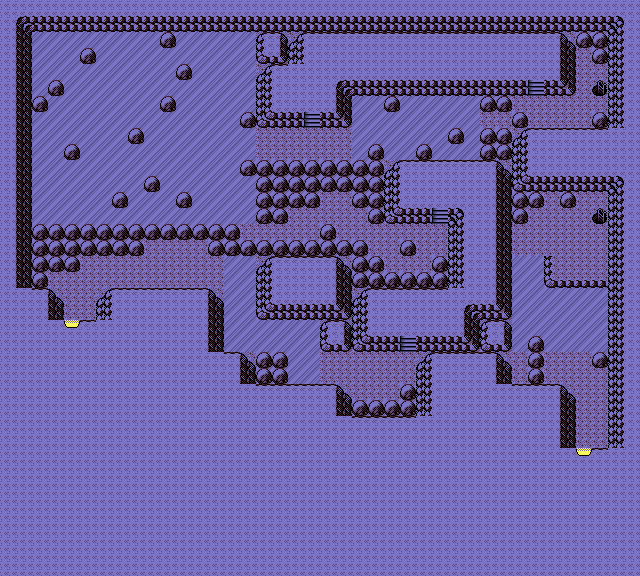
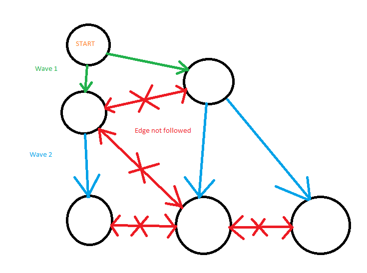

[Source Code](https://github.com/jistjoalal/icemaze)

We're onto the next CodeWars challenge! This time we're taking on kata written by the notorious Voile--the best coder and kata author on CodeWars as far as I can tell. Here's the intro to the kata:

> Any youngster Joeys should probably know what this image means, and why it is traumatic:



And it is indeed traumatic. For those that didn't have a childhood, this is a cave in Pokemon. That ice-looking stuff is ice and 7-yr old me hated it because it made me think when I was just trying to have fun. It's a maze! You slip across until you hit a wall or boulder and then pick a new direction to start sliding. Eventually you hope to end up _off_ the ice and onto the next pokemon gym.

## Up a notch

I never wanted to go back to those caves, but Voile brought me back. And he stepped it up a notch by including over 100 real life example and randomized mazes. The goal was to find the optimal path through all of them, not just by # of input controls, but by distance slid as well. Here's an example of a randomized maze:

```js
 #  #       ##  #  #  #  x   x
  x E###       #x       x    # ##  // S = start
 # #  ###x# # #    # #       ##    // E = end
       #x  #  #x     #  x##### #   // x = non-slippery
      #       x # #   x    #   #   // # = wall
  # x#  #   x#  #x#        xS ##x  // _ = ice
#x#           # #  #    ##
 x x #x    ## #  ###     #    #
   x    #  x#   # #   #   #  #
   #      # ##   # ###   x
     #     ##  # #     #x#  x ###
```

## The plan

So I've recently decided to formalize my computer science education by reading books instead of just hacking around all day. It's already helping me solve some hard problems, and I spent last week working through [one](/blog/hard-problem) that gave me an idea for Voile's ice maze kata.

The last problem was solved through the use of a graph data structure and a depth-first search algorithm. I already knew mazes can be attacked with graphs and figured this would be a good next challenge.

So what's the plan? Use a graph and DFS lol. That didn't work out so well...

## The Graph

This part actually went fine. I established the adjacency table of the graph with a fun algorithm that actually "slid" around the grid for each open tile.

```js
// returns hash table adjacency table for graph
const vertices = g => {
  let tiles = {}
  g.forEach((row, y) => {
    row.forEach((sq, x) => {
      if (sq != "#") {
        tiles[y + "," + x] = slides(g, [y, x])
      }
    })
  })
  return tiles
}

// returns list of coords slidable from coord c over grid g (any dir)
const slides = (g, c) =>
  [..."udrl"].map(d => slide(g, c, d)).filter(v => c != v)

// returns coords of sliding direction d from [y, x] over grid g
const slide = (g, [y, x], d, o) => {
  const vy = d == "u" ? -1 : d == "d" ? 1 : 0
  const vx = d == "l" ? -1 : d == "r" ? 1 : 0
  while (g[y] && g[y][x] && g[y][x] != "#") {
    y += vy
    x += vx
    o = g[y] && g[y][x] && ["x", "E"].includes(g[y][x])
    if (o) break
  }
  return [y - (o ? 0 : vy), x - (o ? 0 : vx)].join`,`
}
```

There was probably (definitely) a better way of drawing out the graph but I knew this wasn't the part of the problem pressed for time. It was good to have some fun before making a fool of myself trying to actually _solve_ the maze.

## Derp First Search

Now, 3 days later, much wiser, I'm able to laugh at my previous self for even attempting such a thing. It said right there in all the books:

> Depth-First Search goes deep, good for finding long paths

> Breadth-First Search goes wide, good for finding short paths

That's the whole reason why I picked DFS for the last problem, since I was looking for a _hamiltonian_ path. Somehow my brain just didn't put it together immediately that I should use BFS to find _optimal_ solutions to mazes...

I'll blame it on laziness over stupidity. Which is tough because I spent like half a day thinking up ways of trying to optimize my DFS for this problem (spoon to a nail).

One idea that I thought would at least help was sorting the edges by their distance to the end/goal tile. Didn't help at all. Due to the slippery nature of this problem, the distance in tiles had nothing to do with traversing the graph. The graph edges represent "slide-ways" that are about as relevant as worm holes to the physical layout.

Another idea, which actually turned out to be useful, was using a closure-scoped variable to "prune" or "trim" long paths early. Because I was searching for the optimal path, I had to keep looking after finding one. But I didn't want to look at any new paths that were longer than the one I already found, that would be a waste. Here's how that worked:

```js
const findPath = (...) => {
  let m = Infinity

  const dfs = (...) => {
    ...
    const l = path.length
    if (l > m) return []
    if (path.found) {
      if (l < m) m = l
      return [path]
    }
    ...
  }

  return dfs(...)
}
```

So the DFS does it's thing and any time it finds a path, sets $m$ to the path length. $m$ will serve as our _best-path_ score, telling us when to abandon paths that are already too long.

## Big Maps

Those big maps were no joke. DFS got me through the sample test cases, but that was it. The first big map it throws me, DFS just <s>cannot do it</s> does it after 81 seconds. Even though the solution is only 7 moves long, it's going and checking all other gazillion sets of moves that are way longer than 7. This is the point where I realized I was dumb for not trying BFS earlier.

## Use a Queue, Luke.

Sometimes when I'm really stuck and frustrated with a problem I watch the [scene](https://www.youtube.com/watch?v=EJz2FXkZb7g) of Luke trying to get his ship out of the swamp. A habit I picked up while building my first crappy compiler that couldn't do recursion for a week. Yoda's words never get me any closer to the solution, but sometimes they get me further from the problem.

> You must unlearn what you have learned.

So I said goodbye to my best friend recursion and began to hammer out a working queue-based BFS algorithm. It ended up looking pretty simple, but still ultimately ineffective at finding the shortest path. Can you see why?

```js
const bfs = (at, end, verts) => {
  const queue = [new Set([at])]
  const paths = []

  while (queue.length) {
    const seen = queue.shift()
    const arr = [...seen]
    at = arr.slice(-1)[0]

    if (at == end) {
      paths.push(arr)
    }

    const edges = verts[at].filter(v => !seen.has(v))
    for (let edge of edges) {
      queue.push(new Set([...arr, e]))
    }
  }

  return paths
}
```

## What is truly seen?

Do you see what's in front of you or do you see a reflection of light? Is it light or the eye that brings about the act of seeing? And of course, if a tree falls in the forest and no one is around to hear it, does it make a noise?

What you see/hear/etc. is everything you're aware of in the moment. What you've seen/heard/etc. is everything you know. Knowledge is arguably what makes us human, but it's a very tricky thing to pin down.

Plato said that all knowledge is remembering. Pretty straightforward idea, as you wouldn't expect to know something you've forgotten. But the real meat of it is implied as the contrapositive:

> All ignorance is forgetting

Yeah. [He really believed it too](https://en.wikipedia.org/wiki/Anamnesis_%28philosophy%29). Don't you remember when you created the universe?

I'm a sucker for simplicity. Reading such prismatic ideas fills me with a warm nostalgic feeling. I probably spend too much time on the computer because when I travel or observe my community that feeling seems so lost. Did the newly conquered and ripe world that Plato inhabited enable him to form such clear ideas? And worse, does the stale and plundered world of today encourage order to apathetically hand the reins back to chaos?

The symbolisms behind our cultures most popular stories (Avengers, Game of Thrones, Black Mirror, House of Cards, etc.) seem to suggest we are headed to hell fast. Zombies encroaching, politicians sinning, technology getting out of our hands... I hope we can _remember_.

21st century people have a strange idea of the past. All of history can weirdly seem like "less stuff" than just one modern year. But how could that be? How did we ever progress to where we are now if the bar was always rising?

I really struggle to accept (or even entertain) Plato's idea of knowledge. Maybe that's actually an advantage of a modern perspective. The idea that I as an individual have instantaneous access to "all that is known" is really not that foreign to me. The difference is, for Plato knowledge was the shield protecting him and his community from the chaotic natural world. Oddly I often feel today as if I'm suffocated by surplus knowledge, longing for a nostalgic sense of simplicity and beauty. [Apparently I'm not the only one](https://www.youtube.com/watch?v=lKXe3HUG2l4).

## Trim the fat

So it's something like this:

1. World is chaos
2. Humans struggle to attain knowledge to overcome chaos
3. World is order
4. Humans struggle to attain knowledge to overcome order
5. repeat

And yes, it's no surprise that the exact opposite of where we are now is exactly what sounds most appealling. As a kid I used to love running back and forth between the hot tub and the cold pool.

Obviously steps 2 and 4 are the interesting bits. The most curious part is the fact that we also _retain_ knowledge from generation to generation. Knowledge is certainly a part of the world, but is it order or chaos? Any engineer managing a legacy project will tell you "both, but mostly chaos."

So thanks Plato, for a few cool ideas. But also thanks for a bunch of crap that people were too dumb to sort through for 1000's of years. Who knows, maybe the West could have actually made faster progress without the influence of Greek thought. I can certainly code up most solutions from scratch faster than I can adapt somebody else's.

Alright long-winded analogy off the checklist, back to the problem. Which by the way is about being overwhelmed by knowledge! I remember the feeling all too clearly... white knuckles and sweaty palms... How could the developers of pokemon expect a 7-yr old kid to navigate a maze with literally hundreds of thousands of incorrect solutions?

## They knew

Just like Plato, Nintendo knew that all humans come pre-packaged with an innate problem solving ability. Something in us _beyond knowledge_ that recognizes patterns and comes up with a way of exploiting them to get to whatever we're aiming at. Knowledge might be remembering, but problem-solving is purely natural--it's built-in.

As a struggling problem solver, I deeply appreciate the rare opportunities I'm presented with **just enough** knowledge to solve the problem. I don't want the answer handed to me, but I also want the answer. What was the bit of information my 7-yr old brain could parse out to be able to solve the maze? That's the gem I need to hand each iteration of my BFS algorithm, instead of the ungangly mass of tangled paths I'm currently racking up.

## How to BFS

I know it's not the most advanced topic in computer science, but jamming this algorithm into my head was a real challenge.

The tricky bit was establishing which nodes were "visited" or "seen" at what point. I was already using a set in my DFS, so I figured that would be enough. Maybe because the last problem I worked on was a hamiltonian path problem it took me some extra time to see that there's no reason to explore nodes already visited (**ever**, not just in that path). So the "visited" set is really a shared resource between iterations, whereas with DFS the "visited" set is unique to each recursive call. I needed that flexibility to solve the last problem, but it was crippling my progress in the ice caves. Here's some MS paint:



Red edges could be part of a hamiltonian path found with DFS but there's no point following them when looking for shortest path with BFS. This really tangled my brain up, maybe because I made the mistake of trying to visualize the paths around the ice.

## Fix the code!

So now that I finally understand the problem, how do I go about implementing it? It was literally as simply as declaring a "visited" boolean array and only pushing edges to the queue that weren't already marked.

```js
const bfs = (...) => {
  ...
  const vis = []
  ...
  while (queue.length) {
    vis[at] = true
    ...
    for (let e of edges) {
      if (!vis[e]) {
        queue.push(new Set([...arr, e]))
      }
    }
  }
  ...
}
```

It looks real simple like this, but I've excluded an essential part that makes it confusing. At each vertex, we calculate the edges going to other tiles. As you can see, I'm queueing the entire path not just the edge I'm currently exploring. This way when it's time to return the path I don't have to traverse a bunch of relational arrays like most BFS example code snippets I found do.

So the unique ordering of elements is definitely relevant to the optimal solution to each map. But it is **not** relevant to the traversal of the graph. This is a big deal. Uniqueness is a binary switch between linear and factorial complexity, and I did not need that complexity when searching for a shortest path with BFS. Because we're queueing instead of recursing, this deceptively simple boolean array somewhat magically steers us only to short paths.

We start at point A then slide to point B. Now at point B, we see our options for where to slide next include point A. Obviously it would be a waste of time to go to A when looking for the shortest path. But let's say we keep going onto C, then onto D. Now at point D, we see our options to slide again include point A. Is is still obvious that we should avoid A? Well, yes... even to a 7-yr old. But not to a computer program, and apparently not to a 24-yr old computer programmer :)

## The Invisible Hand

Hundreds of thousands of clones of my 7-yr old self wandering aimlessly through an old traumatic memory. Suddenly, as if by some miracle, the mass of clambering zombies is transmuted into an elite path-finding team. Equipped with an instananeous communication network, my new algorithm iterations didn't waste time going where others had gone before. Every step became a new step, a valuable step in completing the mission. These iterations had direction, they had guidance.

Pokemon was seriously my favorite thing as a kid. I had all the cards, all the games. The main character of the TV show was the bravest kid in the world to me. How could his parents and Professor Oak send him out on such a perilous and impossible journey? They must not have known what he'd be up against, I thought! It was only due to miracle after miracle that he kept getting closer to being a pokemon master. I had no idea how he did it, and he was my hero.


> Ash is an only child who lived with his mother, Delia, until he left for his Pokémon journey at the age of ten. His main goal in life, as described in the first episode, is to be the world's greatest Pokémon Master. One particular characteristic about Ash that has not changed over the course of the series, aside from his determination and his passion for raising and training Pokémon, is that he is incredibly selfless. He will often go to extraordinary lengths to earn a Pokémon's trust and respect, and to better understand a Pokémon that he sees as troubled. [- Bulbapedia](https://bulbapedia.bulbagarden.net/wiki/Ash_Ketchum#Character)
