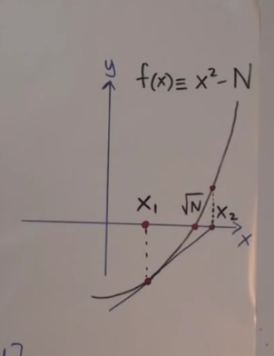
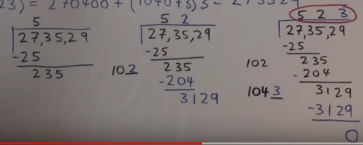
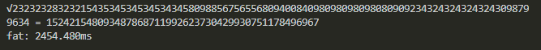
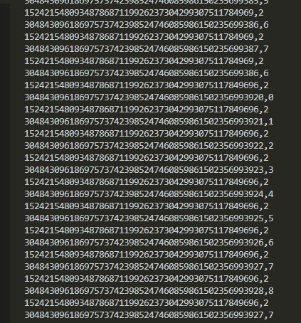
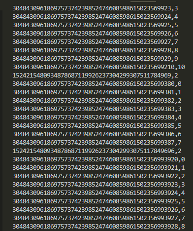

Another day, another kata. This time we are calculating square roots! Just like this, right?

```js
return Math.sqrt(x)
```

Not quite. The catch is that our inputs are huge and we're unable to use any sort of "Big Number" library. Here's an example:

```js
Number = "23232328323215435345345345343458098856756556809400840980980980980809092343243243243243098799634"),
result = "152421548093487868711992623730429930751178496967"
Math.sqrt("232...") // 1.5242154809348788e+47  :(
```

And here's a comment from a fellow sad npmer:

> Not sure what you have against bigint, like sure there is some cryptic way to do it, is that the point of your submission? To only allow one specific resolution to a problem? But you can't come out and say that and would rather waste peoples time rather than enable suitable tooling?

I feel you bro.

## Some Cryptic Way

Lucky for me, I happen to be following a playlist of foundational mathematics techniques/theory from this awesome guy [Norman Wildberger](https://www.youtube.com/user/njwildberger) on YouTube. It's really just dumb luck that I happened to watch his [video](https://www.youtube.com/watch?v=EnxV3_1oaOU) on this exact problem earlier this week.

His video covers the naive (guessing) approach, the Babylonian method, and the Hindu (Vedic) method. These and many other techniques can be found on the Wikipedia page for [Square Root Calculation](https://en.wikipedia.org/wiki/Methods_of_computing_square_roots).

## The Babylonian Method

As Norman explains in his video, this is just Newton's method. We look for roots to the following equation:

$$
f(x) = x^2 - N
$$

Where $N$ is the number we want the square root of.



The strategy is to simply make a guess, $x$, any guess will do. Iterating with Newton's method gets us closer and closer to our result. In other words, we just continue calculating:

$$
next(x) = (x + N/x) / 2
$$

Let's look at the derivative:

$$
\frac{d}{dx} = (1 - \frac{N}{x^2}) / 2
$$

Clearly, as $x$ approaches $\sqrt{N}$, our rate of change approaches 0.

$$
\lim_{x \to \sqrt{N}} \frac{d}{dx} = 0
$$

Magic! We just keep guessing until we get the answer. To make this work for our problem (_integer_ square root), we just stop guessing once our error is less than 1. Here's the code:

```js
// babylonian/newtons method
const bab = (n, x1 = 1) => {
  const x2 = (x1 + n / x1) / 2
  const err = Math.abs(x2 * x2 - n)
  return err < 1 ? ~~x2 : bab(n, x2)
}
```

## Ok...

The Babylonian method was just a warm-up! All the dividing and error calculation don't help us break the problem up, we're still relying on [Javascript's built-in numbers](https://developer.mozilla.org/en-US/docs/Web/JavaScript/Reference/Global_Objects/Number) which only go up to $2^{53} - 1$. Our input constraints for the challenge go much higher:

$$
0 < N < 10^{100}
$$

So let's get started on the real challenge! Norman's description of the Vedic method sounds promising. It's similar to long division in that we find the result in parts. The algorithm is a bit convoluted but each output is a precise digit of our result for relatively constant computational cost.

## The Vedic Method

As you can see, this method looks very similar to long division:



We consider pairs of numbers at a time, and the next digit is calculated by "fitting" as much as we can in that column of the result. It's a greedy algorithm.

## What's really happening?

It's simple enough to follow Norman's instructions to calculate by hand, but how do we code this? There's clearly some repetition, but Norman describes the first step in a simplified way, so it's not obvious where to start. It took me a while, but the code I came up with is basically a 3-part machine.

- Current pair: $N[i : i + 2]$ (string slice)
- Result string: $res$
- Remainder string: $rem$

At each iteration of our algorithm, we calculate the _next_ result and _next_ remainder by considering the _next_ pair. Here's the nice thing about programming with FP principles--I can show you my solution before I show you how it works!

```js
const ved = s => {
  // add 0 to front of odd-digited inputs
  // this way it's easy to index the pairs
  s = s.length % 2 ? "0" + s : s
  let res = "",
    rem = "",
    i = 0
  while (i < s.length) {
    const pair = s.slice(i, (i += 2)),
      [res, rem] = next(res, rem, pair)
  }
  return res
}
```

This function captures the essence of the long-division-ish process. Just like in grade school, we keep a result (on top) and a remainder (on bottom). A long division algorithm would probably look something like this:

```js
// ...
while (i < s.length) {
  const digit = s[i++],
    [res, rem] = next(res, rem, digit)
}
return res
```

Of course, $next$ is the meat of the solution. I'm not sure what to call this abstraction, but it's nice to know it has been applied to [calculating roots of other degrees](https://en.wikipedia.org/wiki/Shifting_nth_root_algorithm).

## First, some Help.

The following equation is the heart of our calculation of the next result and remainder:

$$
(x + y)^2 = x^2 + (20x + y)y
$$

It's just a partial factoring that, when plugging in our partial result as x and solving for y, gives us our next digit of the result. Note that $20x + y$ is the same as concatenating $2x$ with $y$. So let's write a really simple helper that just helps us establish this equality.

```js
// I call it "expand Y"
const expY = (res, y) => (res * 2 + "" + y) * y
```

Now we can write a second helper, $fitY$ that uses this equality to find the "best guess", AKA the largest $y$ such that "expanding" it does not exceed our current remainder. In math:

$$
y \mid (20res + y)y \leq rem
$$

And in code:

```js
const fitY = (res, rem, y = 0) =>
  expY(res, y) <= rem ? fitY(res, rem, y + 1) : y - 1
```

Recursion is tight!

## Next

We can now define $next$ which represents one iteration of our main algorithm. It's the square root equivalent of all the steps in long division before you draw another horizontal line. At the end, we are left with a new result (number on top) and remainder (number on bottom).

```js
const next = (res, rem, pair) => {
  // "bring down" next pair
  const withPair = rem + "" + pair
  // find next digit
  const y = fitY(res, withPair)
  // return new res + rem
  const nRes = res + "" + y
  const nRem = withPair - expY(res, y)
  return [nRes, nRem]
}
```

And with this we have a working solution... sort of. Do you see the problem? It's the same as before with the Babylonian method! We are still relying on built-in operations. Thankfully the Vedic method is easier to adjust to fit our needs. Instead of division and error checking, our new method uses subtraction and multiplication.

## String Arithmetic


So we need to swap out our subtraction in $next$ and our multiplication in $expY$. Let's just say this wasn't my first string arithmetic rodeo so I won't get too detailed even though it is most of the code. They all work under a similar principle of breaking the operation down into calculable parts, exactly how you learn in grade school. Here's what subtraction looks like:

```js
// string subtraction!
const sub = (a, b) => {
  // omitted string prep/padding
  let res = "",
    borrow = false
  // we work from right to left
  for (let i = a.length - 1; i >= 0; i--) {
    let r = a[i] - borrow - ~~b[i]
    borrow = r < 0
    r += r < 0 && 10
    res += r
  }
  // omitted string cleanup/trim
  // return -1 in case of any negative result (lazy)
  return borrow ? "-1" : res
}

const add = (a, b) => {}
const mult = (a, b) => {}
```

Addition is nearly identical but with $carry$ instead of $borrow$, and we'll need it for our multiplication function. Which is also similiar, but "2-dimensional" in that it considers all pairs of digits, not just those directly on top of each other. The last piece of string math we'll need is a "less-than-equal" test for our $fitY$ function. This one's simple enough to show:

```js
// Don't need to worry about rounding errs, so we parse the
// difference as a number using '+', easy!
const le = (a, b) => +sub(a, b) <= 0
```

String arithmetic out of the way and we can now start calculating huge square roots! To reiterate the following operations were translated to take strings instead of numbers...

- Subtracting to find our new remainder in $next$
- Multiplying in $expY$
- Adding in $mult$
- Less-than-equal test in $fitY$

...and thus enhanced to the realm of **fat** numbers

## Fat



Not gonna lie, it felt good to just knock all that shit out after the hours I've spent on project euler. But the gravity of these numbers is starting to slow us down. Check that runtime... 2.5s, what gives? Let's see if printing the inputs to our string operations turns up anything that looks cachable. I knew multiplication was the most expensive, so I started there.



Hmm, we really repeat a lot of "times 2" operations. Let's cache those, and any other result for that matter.

```js
let memo = {}
const mult = (a, b) => {
  const key = a + "," + b
  if (memo[key]) return memo[key]
  // calculate res...
  return (memo[key] = res)
}
```

Let's see if that helped:



Nice! Far less repetive multiplication operations! We're clocking in at around half the speed now. Good, but not good enough. Let's check addition next since it's used profusely by $mult$.

It was bad. So bad it needed a horrible ugly video showcasing just how bad it was.

<video controls src="https://i.imgur.com/GdsAIhj.mp4"> </video>

Yeah. We're adding zero. Like a billion times. So let's not do that and see what happens:

```js
// in "mult", we had this line:
res = add(res, r)
// and changed it to this:
if (+r) res = add(res, r)
```

No joke, these simple optimizations cut my runtime from 2500ms to ~150ms.

## Run It

So the CodeWars challenge has ~120 tests \* my worst runtime = ~18 seconds. You get 12 seconds on CodeWars, and I was able to finish in about 6! My math is always off, but hey I'll take the win. This was a fun-ass Kata.

## Conclusion

- We use Vedic/Hindu digit-by-digit square root calculation
- Input constraints force us to build string math helpers
- Optimizations through caching and the genius idea of not adding zero get us across the finish line

That's another black box pried open. Another day, another kata...
