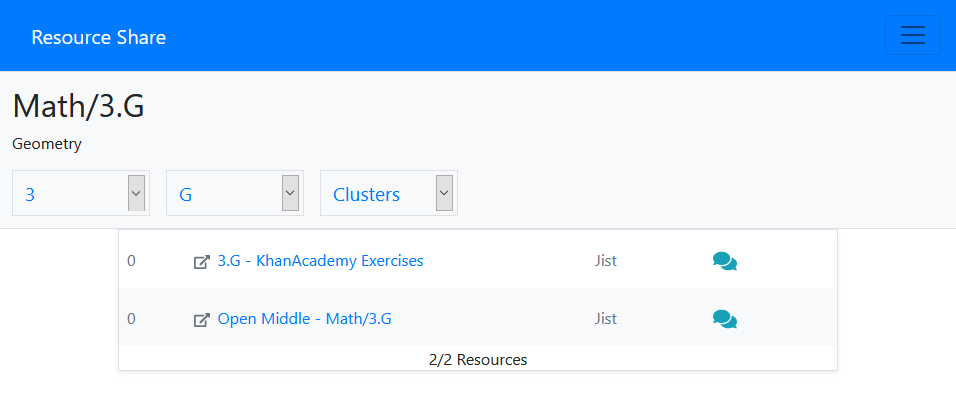

## Impact

Although this was just a learning project, the mission that it represents is a significant one. CCShare is a map of the [Common Core State Standards](http://www.corestandards.org/) for math. Lesson plans, homework, and online tools (anything really) can be shared among teachers on CCShare. All resources are associated with learning standards and can be voted on similarly to reddit. The aim is to crowd-source the mountainous task of finding the most efficient free educational resources.

[Explore the demo](https://ccshare.herokuapp.com/)

- Please be patient (~20 sec.) for heroku free tier :)

## Challenges

- **Order out of chaos**: [Common Core](http://www.corestandards.org/read-the-standards/) doesn't have an API. With thousands of standards scattered across hundreds of pages on their website, I was relieved to find an "XML document for developers." After converting to JSON, parsing the standards and building an object reflecting the hierarchical structure of the standards, I finally had the whole curriculum. Because of the way I implemented the curriculum data structure, I was able to design an easy system of dropdowns for navigating the thousands of resources which I scraped from the web using [Cheerio]("https://cheerio.js.org/").

- **The meteor and the dinosaurs**: CCShare was definitely my most extensive project built with Meteor, which I honestly really love working with. I wish I was a developer when it was new, because the community has certainly died down a bit in only a few years. Figuring out how to implement file upload to Amazon S3 and configuring integration tests and continuous integration were particularly challenging. Documentation was a little sparse, but thankfully I was able to get some help from the very passionate remaining community members on the Meteor forums.

- **Automated tests**: I decided I wanted to learn how to test my apps. After much research and many failed attempts, I settled on [Cypress](https://cypress.io) for integration testing and [Travis]("https://travis-ci.com/") for CI. The process was difficult to figure out, but simple once it was setup. I had to document it on a blog post [here](/blog/meteor-e2e-ci).
