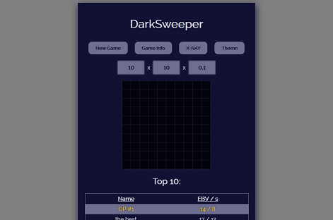

## Impact

Minesweeper is a classic puzzle game. I spent many hours uncovering numerical patterns as fast as possible while flagging mines. It's amazing how something which is at first so cognitively demanding can become habit with enough practice. Building a clone of this favorite of mine was a great introduction to React. Generating boards of any size and mine density, coding my own cheats, and deploying it online made for an incredibly rewarding learning experience.

I posted Darksweeper to reddit a while back, and for some reason this month it's gotten more popular. There's nearly 15 pages of high scores now and my AWS bill is more than pennies for the first time. But I still have the high score! See if you can beat it:

[Darksweeper](https://darksweeper.com/)

## Challenges

- **Learning React**: This was an early project in my education. Darksweeper taught me how to compose an interactive app out of mentally digestible components. I used plain old local state in react and learned a lot about functional programming principles and why unaccounted for state is the enemy of us all.

- **High Score**: How do you score a minesweeper game? The old windows version only gives you your time. After some researching I discovered the [3BV](http://www.minesweeper.info/wiki/3BV) scoring method. It's just the minimum number of left clicks needed to win. Realizing I could repurpose my "playing-the-game" functions for "scoring-the-game" was an awesome moment. Scoring the game was just the computer playing it and I had discovered the joys of reusing code.

- **Leaderboard**: After I had a scoring method, I had to assert my minesweeper dominance over any prospective users of my new site. This was my first full-stack project. I decided on a mono repo express server with my create-react-app in the client folder. The server connects to a database on mlab and the client gets the scores with Apollo and GraphQL. When it's time to deploy, I build the client and the server statically serves the build folder.

- **Live on the internet**: Speaking of deploying, I settled on AWS elastic beanstalk. The intricacies of devops still elude me, but deploying to AWS was a great exercise to put a dent in my ignorance. Between the domain name, AWS instance, cloud database, client and prod builds for react, my rabbit hole traversal skills grew tremendously. As a great wizard once said,

> "The key to understanding complicated things is to know what not to look at."
