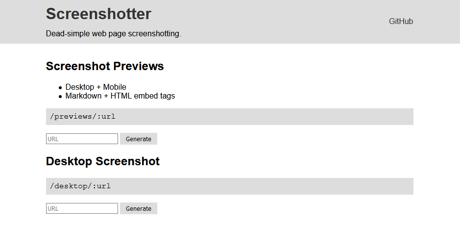

## Impact

As a student developer building lots of projects, I found myself updating screenshots in my readme files and realized I could automate the process. What if my readme updated itself? That was the goal of this project. It soon developed into a way to learn puppeteer and more about the web.

## Challenges

- **The main mission**: Self-updating screenshots, I decided, could be accomplished by building a web API that would take a url as parameter and return an image. Getting this working was easy after watching [Eric Bidelman](https://github.com/ebidel)'s [talk](https://www.youtube.com/watch?v=lhZOFUY1weo) on [Puppeteer](https://pptr.dev).

- **Github interferes**: I decided to try out my new screenshotter API, and it appeared to work! Then I updated the page again and the screenshot still looked the same. Turns out Github was caching my image, for a year! After some research, I was able to override this behavior by setting some HTTP headers. Sorry, Github.

- **Tests**: I hadn't tested backend code before this, but an npm package called supertest makes testing express easy. Testing seems really complicated at first, but it helps you develop your understanding of what you are coding. Also, the status badges that TravisCI gives you makes it all worth it. Those little things are what made me realize there must be a way around the caching problem on Github.

- **Heroku interferes**: Heroku free tier served me well for simple todo apps, but it turns out spinning up a headless browser is pretty expensive and PNGs are pretty big files. I did all that I could think to optimize, but 512MB RAM and 1 worker couldn't handle the load of my celebratory blog post with 10 screenshots. Heroku apps also go to sleep after a period of inactivity. I tried getting help at a Freecodecamp meetup, and someone suggested to try another host. After migrating some of the code to Google Cloud Functions I was able to get it working again, although it was still slow. I'm afraid a live-updating screenshot API is not in the budget of a college student.
